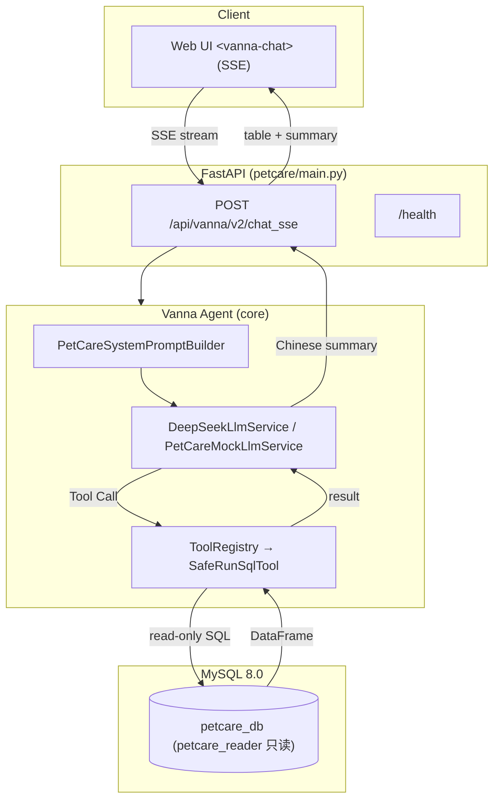

# PetCare AI Analytics Assistant

> 宠物医院智能数据分析助手 —— 自然语言问数，直接得到答案。

[English](./README_EN.md) | 中文

本项目基于 [vanna-ai/vanna](https://github.com/vanna-ai/vanna) 2.0.2（MIT License）进行二次开发。

---

## 项目截图

> 截图区域（待补充）：Web UI 提问 → 流式表格 + 中文摘要的演示截图将在此展示。

---

## Core Features

- **自然语言问数（Text-to-SQL）**：输入"最近三个月收入最高的医生是谁？"，自动生成只读 SQL 并流式返回表格 + 中文摘要
- **DeepSeek Tool Call**：OpenAI 兼容接口，真实 LLM 工具调用链路
- **MySQL 只读安全边界**：应用层 SQL 校验 + 数据库 `petcare_reader` 只读账户（纵深防御）
- **业务分析时间语义**：所有"本月 / 上月 / 最近三个月"基于 `PETCARE_AS_OF_DATE` 统一基准
- **Mock / DeepSeek 双模式**：零成本确定性测试模式 + 真实模型模式
- **90 项自动化测试**：79 项默认测试 + 11 项真实 DeepSeek 集成测试

---

## Key Engineering Challenge: CTE Result Propagation

**问题**：上游 `RunSqlTool` 仅依据 SQL 首 token 是否为 `SELECT` 判断查询类型（`sql.split()[0] == "SELECT"`），导致：

1. `WITH ... SELECT` CTE 查询被误判为 DML
2. 结果只返回 `"Query executed successfully. N row(s) affected."`，**实际数据无法返回给 LLM 与前端**
3. Agent 看不到数据 → 反复调用 SQL 直到工具迭代上限（最多 10 次），任务失败

**修复**：PetCare 在 `SafeRunSqlTool`（`petcare/safety.py`）应用层实现兼容修复——安全校验通过后，`SELECT` 与 `WITH` 统一走结果集路径（DataFrameComponent + 完整数据 + row_count）。**未直接修改上游核心实现**。

**效果**（3 次真实 DeepSeek 验证）：
- 工具调用次数由最多 10 次降到 **1–2 次**
- 3/3 次正确生成最终摘要、未触达迭代上限、结果与手工基准一致

详见 [`petcare/docs/upstream-compatibility.md`](petcare/docs/upstream-compatibility.md)。

---

## 技术架构



---

## Quick Start

### 环境要求

- Python **3.10+**（推荐 3.11/3.12）
- MySQL **8.0+**
- 可选：DeepSeek API Key（DeepSeek 模式）

### 安装

```bash
# 1. 克隆仓库并进入根目录
git clone https://github.com/fanfan23334/petcare-ai-analytics-assistant.git
cd petcare-ai-analytics-assistant

# 2. 创建虚拟环境并激活
python -m venv .venv
# Linux/macOS: source .venv/bin/activate   Windows: .venv\Scripts\activate

# 3. 安装依赖（editable，含 servers/mysql/openai）
pip install -e ".[servers,mysql,openai,dev]"
```

### 初始化数据库

```bash
# 在仓库根目录执行（需本地 MySQL 8.0 运行中）
python petcare/db/setup_mysql.py --host 127.0.0.1 --user root --password YOUR_MYSQL_PASSWORD
# 输出校验（实际行数）：
#   owners=30 pets=50 doctors=8 appointments=342 medical_records=248 bills=500
```

### 创建只读账户

```bash
# 编辑 petcare/db/create_readonly_user.sql，替换密码占位符后执行：
mysql -u root -p < petcare/db/create_readonly_user.sql
# 验证：SHOW GRANTS FOR 'petcare_reader'@'localhost';  # 仅 SELECT on petcare_db.*
```

应用连接必须使用 `petcare_reader`，禁止 root（见安全设计）。

### 配置 .env

```bash
cp petcare/.env.example petcare/.env
# 编辑 petcare/.env：
#   MYSQL_USER=petcare_reader
#   MYSQL_PASSWORD=<只读账户密码>
#   LLM_PROVIDER=mock            # mock 或 deepseek
#   LLM_API_KEY=<你的 DeepSeek Key>   # deepseek 模式必需
#   PETCARE_AS_OF_DATE=2026-04-30     # 业务分析基准日
```

`.env` 已被 `.gitignore` 排除，请勿提交。

### 启动

```bash
# Mock 模式（无需 API Key）：
LLM_PROVIDER=mock python -m petcare.main
# Windows: $env:LLM_PROVIDER="mock"; python -m petcare.main

# DeepSeek 模式（.env 配置 LLM_PROVIDER=deepseek + LLM_API_KEY）：
python -m petcare.main
```

### 访问 Web UI

浏览器打开 **http://127.0.0.1:8000**

- `/` Web 聊天界面（提问 → 流式表格 + 摘要）
- `/api/vanna/v2/chat_sse` SSE 流式接口
- `/health` 健康检查（含 provider/model）

---

## 测试

| 类别 | 数量 | 命令 | 说明 |
|---|---|---|---|
| 默认测试 | **79** | `python -m pytest petcare/tests -m "not integration" -q` | 无需 API Key、无需外部服务（需本地 MySQL） |
| 默认全量 | 79 passed, **11 skipped** | `python -m pytest petcare/tests -q` | integration 默认跳过 |
| DeepSeek 集成测试 | **11** | `python -m pytest petcare/tests -m integration -q` | **真实调用 DeepSeek**，需要 `LLM_API_KEY`，仅手动执行 |
| **总计** | **90** 项自动化测试 | — | — |

注意：集成测试（integration）为真实模型测试，不是单元测试；CI 中只运行默认测试，不会调用任何外部 API。

---

## 详细文档

- [数据库设计说明](petcare/db/DESIGN.md)：六表业务模型、Text-to-SQL 友好设计、收入口径
- [安全设计](petcare/docs/database-security.md)：应用层校验 + 只读账户纵深防御
- [上游兼容性说明](petcare/docs/upstream-compatibility.md)：上游缺陷清单、修复方式、升级回归清单

---

## 限制

- **非生产系统**：面向企业运营分析场景的 AI 应用工程项目（学习与求职展示），未做多租户、鉴权体系与生产级监控
- **真实 LLM 输出存在随机性**：DeepSeek 生成的 SQL 偶发遗漏时间窗口等语义，建议关键查询人工复核
- **评估集规模有限**：当前 10 个基准问题的评估为采样性质，非统计完备基准
- 工具迭代上限 `max_tool_iterations=4`（保护边界）

## 合成数据声明

本项目数据库中的姓名、手机号、地址、账单与诊疗数据均为**程序生成的合成数据**（`random.seed(42)` 确定性生成，手机号为不可拨打的占位符）。如有与真实人物/号码雷同，纯属巧合。

---

## 许可证与作者

- **MIT License**（详见 [LICENSE](LICENSE)，保留上游 `Copyright (c) 2024 Vanna.AI`）
- 作者：Yuxi Wen（联系邮箱 17666534357wyx@gmail.com）
- 项目定位：AI Application Engineer / FDE 求职展示项目
- 欢迎 Issues / PR 交流
