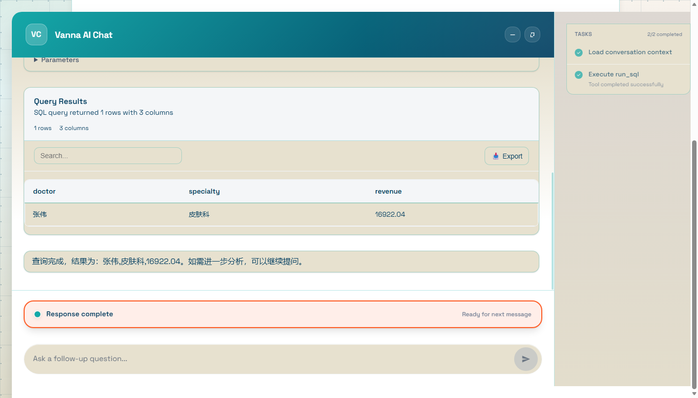
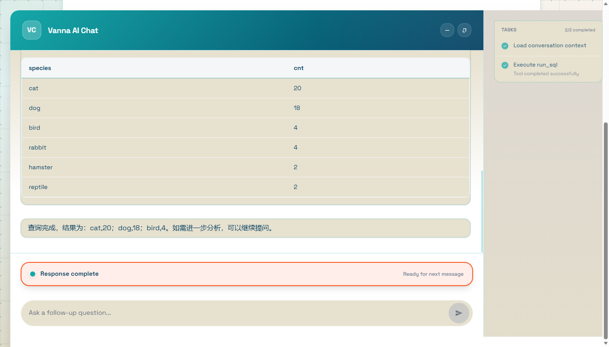
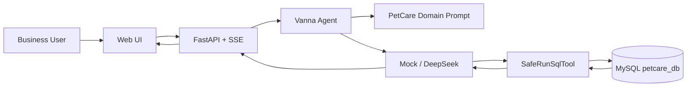

<div align="center">

# PetCare AI Analytics Assistant

**面向宠物医院运营场景的自然语言数据分析助手**

*Ask business questions in natural language and receive SQL-backed tables and operational insights.*

[English](./README_EN.md) | 中文

[Quick Start](#11-quick-start) · [Architecture](#7-how-it-works) · [Documentation](#12-documentation)

---

[](https://github.com/fanfan23334/petcare-ai-analytics-assistant/blob/main/pyproject.toml)
[](https://github.com/fanfan23334/petcare-ai-analytics-assistant/blob/main/petcare/main.py)
[](https://github.com/fanfan23334/petcare-ai-analytics-assistant/blob/main/petcare/db/schema.sql)
[](https://github.com/fanfan23334/petcare-ai-analytics-assistant/blob/main/petcare/deepseek_llm.py)
[](https://github.com/fanfan23334/petcare-ai-analytics-assistant/blob/main/petcare/docs/upstream-compatibility.md)
[](https://github.com/fanfan23334/petcare-ai-analytics-assistant/tree/main/petcare/tests)
[](https://github.com/fanfan23334/petcare-ai-analytics-assistant/actions/workflows/tests.yml)
[](https://github.com/fanfan23334/petcare-ai-analytics-assistant/blob/main/LICENSE)
[](https://github.com/fanfan23334/petcare-ai-analytics-assistant/tags)

</div>

---

## 2. Product Demo

<p align="center">
  
</p>

用户输入：

> **"最近三个月收入最高的医生是谁？"**

系统真实执行：

1. 解释业务时间窗口（"最近三个月" = 2026-02-01 ~ 2026-04-30，基于 `PETCARE_AS_OF_DATE`）
2. 生成只读 SQL（`SELECT ... FROM bills JOIN doctors WHERE pay_status='paid' ...`）
3. 使用 `petcare_reader` 只读账户查询 MySQL
4. 流式返回数据表
5. 生成中文业务摘要

<p align="center">
  
</p>

## 3. What PetCare Does

宠物医院运营人员用自然语言提问，系统把问题翻译成**只读 SQL**，查询 MySQL 业务库，并以**流式表格 + 中文摘要**返回答案。覆盖收入、医生工作量、宠物类型、预约与客户消费五类分析场景。

## 4. Key Capabilities

| Natural-Language Analytics | Defense-in-Depth SQL Safety | Provider Architecture | Business Semantics |
|---|---|---|---|
| 自然语言转只读 SQL<br>流式表格 + 中文摘要 | 应用层 SQL 校验<br>MySQL `petcare_reader` 最小权限账户 | Mock 确定性模式<br>DeepSeek 真实 Tool Calling | 统一 `PETCARE_AS_OF_DATE`<br>明确收入与时间窗口口径 |

## 5. Example Questions

以下问题为系统支持的真实查询（答案为当前 `petcare_db` 数据实际查询结果）：

| 问题 | 回答 |
|---|---|
| 最近三个月收入最高的医生是谁？ | 张伟（皮肤科），¥16,922.04 |
| 本月已经支付的账单收入是多少？ | ¥32,218.22 |
| 哪种宠物类型的预约量最高？ | dog（狗），137 次预约 |
| 哪些客户养了多只宠物？ | 12 位客户 |
| 多宠物客户是否比单宠物客户消费更高？ | 是——多宠物客户人均 ¥11,700.90，单宠物客户人均 ¥1,989.13 |

## 6. Key Engineering Challenge: CTE Result Propagation

**问题**：上游 `RunSqlTool` 仅依据 SQL 首 token 判断查询类型（`sql.split()[0] == "SELECT"`），导致：

1. `WITH ... SELECT` CTE 查询被误判为 DML
2. 结果只返回 `"Query executed successfully. N row(s) affected."`——**实际数据无法返回给 LLM 与前端**
3. Agent 看不到数据 → 反复调用 SQL 直到工具迭代上限（最多 10 次），任务失败

**修复**：在 `SafeRunSqlTool`（`petcare/safety.py`）应用层实现兼容修复——安全校验通过后，`SELECT` 与 `WITH` 统一走结果集路径（DataFrameComponent + 完整数据 + row_count）。**未直接修改上游核心实现**。

**效果**（3 次真实 DeepSeek 验证）：工具调用次数由最多 10 次降到 **1–2 次**；3/3 次正确生成最终摘要、未触达迭代上限、结果与手工基准一致。

## 7. How It Works



## 8. Engineering Highlights

- **CTE 兼容修复**：发现并修复上游 `RunSqlTool` 的类型识别缺陷（Q10 根因），工具调用从 10 次降到 1–2 次
- **纵深防御**：应用层只读校验 + 数据库最小权限账户，双层防线
- **确定性测试体系**：`random.seed(42)` 合成数据 + Mock LLM，90 项测试零 API 消耗
- **兼容层设计**：shim / adapter 模式修复 7 项上游缺陷，不侵入核心

## 9. Safety Model

- **应用层**（`SafeRunSqlTool`）：仅允许 `SELECT` / `WITH`；禁止写操作关键字、多语句、`INTO OUTFILE`、`SLEEP`、系统库访问、注释绕过与超长 SQL
- **数据库层**：`petcare_reader` 账户仅 `SELECT on petcare_db.*`，写操作由 MySQL 直接拒绝（最终权限边界）
- **密钥管理**：环境变量 / `.env`，错误响应脱敏（不泄露 Key、密码、连接串、堆栈）

## 10. Evaluation and Tests

| 类别 | 数量 | 命令 | 说明 |
|---|---|---|---|
| 默认测试 | **79** | `python -m pytest petcare/tests -m "not integration" -q` | 无需 API Key（需本地 MySQL） |
| 默认全量 | 79 passed, 11 skipped | `python -m pytest petcare/tests -q` | integration 默认跳过 |
| DeepSeek 集成测试 | **11** | `python -m pytest petcare/tests -m integration -q` | 真实 DeepSeek 调用，需 `LLM_API_KEY`，仅手动 |
| **总计** | **90** | — | — |

CI（[PetCare Tests](https://github.com/fanfan23334/petcare-ai-analytics-assistant/actions/workflows/tests.yml)）：ubuntu-latest + Python 3.11 + MySQL 8.0 service，仅运行默认测试，不调用任何外部 API。

## 11. Quick Start

### 环境要求

- Python **3.10+**（推荐 3.11/3.12）、MySQL **8.0+**
- 可选：DeepSeek API Key

### 安装

```bash
git clone https://github.com/fanfan23334/petcare-ai-analytics-assistant.git
cd petcare-ai-analytics-assistant
python -m venv .venv
# Linux/macOS: source .venv/bin/activate   Windows: .venv\Scripts\activate
pip install -e ".[servers,mysql,openai,dev]"
```

### 初始化数据库

```bash
# 仓库根目录执行（需本地 MySQL 8.0 运行中）
python petcare/db/setup_mysql.py --host 127.0.0.1 --user root --password YOUR_MYSQL_PASSWORD
# 实际行数：owners=30 pets=50 doctors=8 appointments=342 medical_records=248 bills=500
```

### 创建只读账户

```bash
# 编辑 petcare/db/create_readonly_user.sql 替换密码占位符后：
mysql -u root -p < petcare/db/create_readonly_user.sql
# 验证：SHOW GRANTS FOR 'petcare_reader'@'localhost';   # 仅 SELECT on petcare_db.*
```

### 配置 .env

```bash
cp petcare/.env.example petcare/.env
# MYSQL_USER=petcare_reader / MYSQL_PASSWORD=<只读密码>
# LLM_PROVIDER=mock | deepseek / LLM_API_KEY=<你的 Key>
# PETCARE_AS_OF_DATE=2026-04-30
```

`.env` 已被 `.gitignore` 排除，请勿提交。

### 启动与访问

```bash
# Mock 模式（无需 Key）：LLM_PROVIDER=mock python -m petcare.main
# DeepSeek 模式：python -m petcare.main
```

浏览器打开 **http://127.0.0.1:8000**（`/health` 返回 provider/model）。

## 12. Documentation

- [数据库设计说明](petcare/db/DESIGN.md)：六表业务模型、Text-to-SQL 友好设计、收入口径
- [安全设计](petcare/docs/database-security.md)：应用层校验 + 只读账户纵深防御
- [上游兼容性说明](petcare/docs/upstream-compatibility.md)：上游缺陷清单、修复方式、升级回归清单

## 13. Current Limitations

- **非生产系统**：面向企业运营分析场景的 AI 应用工程项目（学习与求职展示），未做多租户、鉴权体系与生产级监控
- **真实 LLM 输出存在随机性**：DeepSeek 生成的 SQL 偶发遗漏时间窗口等语义，建议关键查询人工复核
- **评估集规模有限**：当前基准问题评估为采样性质，非统计完备基准
- 工具迭代上限 `max_tool_iterations=4`（保护边界）

**合成数据声明**：数据库中姓名、手机号、地址、账单与诊疗数据均为程序生成的合成数据（`random.seed(42)`，手机号为不可拨打的占位符），如有雷同纯属巧合。

## 14. Upstream Attribution

本项目基于 [vanna-ai/vanna](https://github.com/vanna-ai/vanna) **2.0.2**（MIT License）二次开发：

- 上游提供：Agent 框架、FastAPI 服务基础、`RunSqlTool`/`MySQLRunner`、Web 组件
- 本项目新增：`petcare/` 业务层（六表模型、领域 Prompt、DeepSeek Provider、SQL 安全层、只读账户、错误脱敏、测试评估、CTE 兼容修复）
- 上游缺陷与升级回归清单：[upstream-compatibility.md](petcare/docs/upstream-compatibility.md)

## 15. License

[MIT License](LICENSE)（保留上游 `Copyright (c) 2024 Vanna.AI`）。

作者：Yuxi Wen（17666534357wyx@gmail.com）— AI Application Engineer / FDE 求职展示项目，欢迎 Issues / PR。
