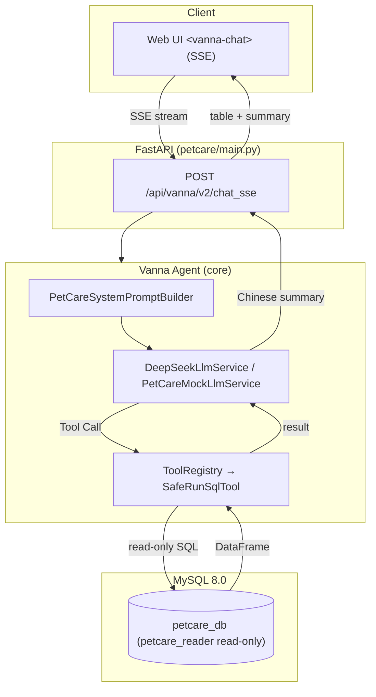

# PetCare AI Analytics Assistant

> Pet hospital AI analytics assistant — ask in natural language, get answers directly.

[English](./README_EN.md) | [中文](./README.md)

This project is a secondary development based on [vanna-ai/vanna](https://github.com/vanna-ai/vanna) 2.0.2 (MIT License).

---

## Overview

Operations staff ask natural-language questions (e.g. "Which doctor earned the most in the last three months?"). The system generates read-only SQL via an LLM, queries the MySQL business database, and returns streaming tables plus Chinese summaries. Aimed at pet hospital managers and operations staff for revenue analysis, doctor workload, pet-type statistics, appointment analysis, and customer spend analysis.

## Architecture



## Key Features

- **Text-to-SQL**: natural language → generated read-only SQL → streaming table + Chinese summary
- **DeepSeek Tool Call**: OpenAI-compatible integration, real LLM tool-calling chain
- **Read-only MySQL boundary**: application-layer SQL validation + `petcare_reader` read-only DB account (defense in depth)
- **Business time semantics**: "this month / last month / recent 3 months" all relative to `PETCARE_AS_OF_DATE`
- **Mock / DeepSeek dual mode**: zero-cost deterministic testing + real model mode
- **90 automated tests**: 79 default + 11 real DeepSeek integration

## CTE Compatibility Fix

**Problem**: upstream `RunSqlTool` classifies query type only by the first token (`sql.split()[0] == "SELECT"`), so:

1. `WITH ... SELECT` CTE queries were misclassified as DML
2. Results returned only `"Query executed successfully. N row(s) affected."` — the actual data never reached the LLM or the frontend
3. The Agent could not see data, repeatedly re-invoked SQL, and hit the tool iteration limit (max 10), failing the task

**Fix**: PetCare implements the fix at the application layer in `SafeRunSqlTool` (`petcare/safety.py`) — after validation, both `SELECT` and `WITH` queries go through the result-set path (DataFrameComponent + full data + row_count). **The upstream core implementation was not modified.**

**Effect** (3 real DeepSeek runs): tool calls dropped from up to 10 to **1–2**; 3/3 runs converged with correct summaries and results matching the manual baseline.

## Quick Start

### Requirements

- Python **3.10+** (3.11/3.12 recommended)
- MySQL **8.0+**
- Optional: DeepSeek API Key (DeepSeek mode)

### Install

```bash
git clone https://github.com/fanfan23334/petcare-ai-analytics-assistant.git
cd petcare-ai-analytics-assistant
python -m venv .venv
# Linux/macOS: source .venv/bin/activate   Windows: .venv\Scripts\activate
pip install -e ".[servers,mysql,openai,dev]"
```

### Initialize the database

```bash
# From the repository root (local MySQL 8.0 required)
python petcare/db/setup_mysql.py --host 127.0.0.1 --user root --password YOUR_MYSQL_PASSWORD
# Expected counts: owners=30 pets=50 doctors=8 appointments=342 medical_records=248 bills=500
```

### Create the read-only account

```bash
# Edit petcare/db/create_readonly_user.sql, replace the password placeholder, then:
mysql -u root -p < petcare/db/create_readonly_user.sql
# Verify: SHOW GRANTS FOR 'petcare_reader'@'localhost';  # SELECT only on petcare_db.*
```

### Configure .env

```bash
cp petcare/.env.example petcare/.env
# Edit petcare/.env:
#   MYSQL_USER=petcare_reader
#   MYSQL_PASSWORD=<read-only account password>
#   LLM_PROVIDER=mock            # mock or deepseek
#   LLM_API_KEY=<your DeepSeek Key>   # required for deepseek mode
#   PETCARE_AS_OF_DATE=2026-04-30     # business analysis reference date
```

### Run

```bash
# Mock mode (no API key):
LLM_PROVIDER=mock python -m petcare.main
# Windows: $env:LLM_PROVIDER="mock"; python -m petcare.main

# DeepSeek mode (LLM_PROVIDER=deepseek + LLM_API_KEY in .env):
python -m petcare.main
```

Open **http://127.0.0.1:8000** in a browser. `/health` reports provider/model.

## Testing

| Category | Count | Command | Note |
|---|---|---|---|
| Default tests | **79** | `python -m pytest petcare/tests -m "not integration" -q` | No API key, no external services (local MySQL required) |
| Default full run | 79 passed, **11 skipped** | `python -m pytest petcare/tests -q` | integration skipped by default |
| DeepSeek integration | **11** | `python -m pytest petcare/tests -m integration -q` | **Real DeepSeek API calls**, requires `LLM_API_KEY`, manual only |
| **Total** | **90** automated tests | — | — |

Integration tests are real-model tests, not unit tests. CI runs only the default tests and never calls external APIs.

## Security

- **Defense in depth**: application-layer `SafeRunSqlTool` read-only validation (SELECT/WITH whitelist, forbidden write keywords, no multi-statement, dangerous patterns, length limits) + database-layer `petcare_reader` read-only account (SELECT only, final boundary)
- **Secret management**: environment variables / `.env` only; error responses are sanitized (no keys, passwords, connection strings, or stack traces)
- See [petcare/docs/database-security.md](petcare/docs/database-security.md)

## Limitations

- **Not a production system**: an AI application engineering project for enterprise operations scenarios (learning and portfolio), without multi-tenancy, auth, or production monitoring
- **Real LLM output has randomness**: DeepSeek-generated SQL may occasionally miss time-window semantics; review critical queries manually
- **Small evaluation set**: the 10-question baseline is a sample, not a statistically complete benchmark
- Tool iteration cap `max_tool_iterations=4` (protection boundary)

## Upstream Attribution

- Upstream: [vanna-ai/vanna](https://github.com/vanna-ai/vanna) (MIT, Copyright (c) 2024 Vanna.AI)
- Version pinned: **2.0.2** (upstream tag `v2.0.2`)
- This project adds the `petcare/` business layer, fixes compatibility issues (see [petcare/docs/upstream-compatibility.md](petcare/docs/upstream-compatibility.md)), and preserves the upstream LICENSE and copyright.
- All names, phone numbers, addresses, bills and diagnoses in this database are **synthetic data** generated programmatically (`random.seed(42)`, non-dialable placeholder phone numbers). Any resemblance to real people or numbers is coincidental.

---

## License

MIT License (see [LICENSE](LICENSE), preserving upstream `Copyright (c) 2024 Vanna.AI`).

Author: Yuxi Wen (17666534357wyx@gmail.com) — AI Application Engineer / FDE portfolio project.
